2026-02-16

8 spotkań 17:30 - 19:45 + 1 z lekarzem

- 16.02
- 17.02
- 18.02
- 20.02
- 23.02 
- 24.02 --- lekarz
- 25.02 
- 26.02
- 27.02 

80% obecności na wykładach (7 spotkań)

## Egzamin z teorii 
- Jest taki sam jak w WORD
- 32 pytania: 20 przepisy + 12 wiedza specjalistyczna --- 25 min czasu
(zaliczenie $\ge \frac{68}{74}$ pkt)

## Egzamin praktyczny 
- Trwa około 45 min
- Musimy wiedzieć na czym polega
- Maksymalnie 5 minut na obsługę (sprawdzenie) samochodu
- Polecenia od egzaminatora będą zgodne z przepisami ruchu drogowego
 
---

<!--# Wykład-->

::: {.definition title="Pojazd silnikowy" ref=""}
Napędzany mechanicznie pojazd, który porusza się dzięki własnemu napędowi a nie
jest motorowerem ani pojazdem szynowym
:::
 
::: {.definition title="Pojazd samochodowy" ref=""}
Pojazd silnikowy, którego konstrukcja umożliwia jazdę z prędkością
przekraczającą 25 km/h. Określenie to nie obejmuje ciągnika rolniczego
:::

## Kategoria B 

::: {.definition title="DMC" ref=""}
Dopuszczalna masa całkowita (masa własna + maksymalny ładunek)
:::
::: {.definition title="RMC" ref=""}
Rzeczywista masa całkowita (masa własna + rzeczywisty ładunek)
:::

Uprawnia do kierowania pojazdem samochodowym o DMC do 3.5 t

Opcjonalnie plus:

- Przyczepa o DMC do 750 kg **lub** 
- Przyczepa dowolna ale łączna DMC zespołu $\le 3.5$ t

RMC przyczepy nie może być większa od RMC pojazdu

## Rodzaje skrzyżowań

- Równorzędne
- Z pierwszeństwem
- O ruchu okrężnym (ronda)

::: {.definition title="Wymuszenie pierwszeństwa" ref=""}
Zmuszenie innego uczestnika ruchu do istotnej zmiany kierunku lub prędkości
poruszania się
:::

### Równorzędne 

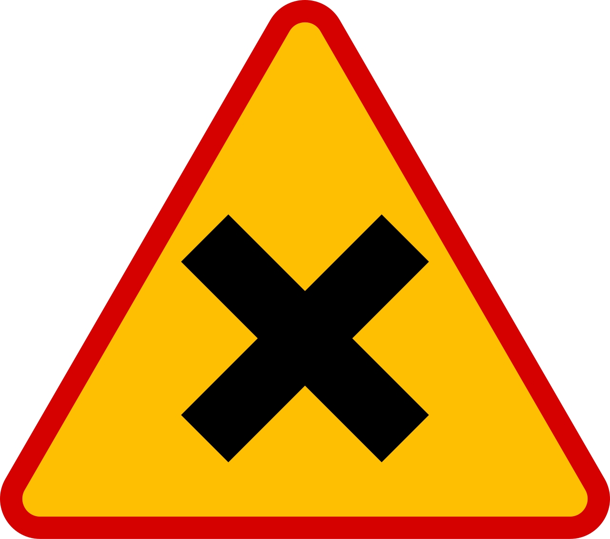{height=15%}

Kolejność przejazdu:

1. Pojazdy uprzywilejowane:

::: {.definition title="Pojazd uprzywilejowany" ref=""}
Mający **łącznie**:

- Sygnał świetlny niebieski
- Sygnał dźwiękowy
- Światła mijania (krótkie) lub drogowe (długie)

Zaliczamy również kolumnę (na początku i na końcu uprzywilejowane mające
dodatkowo sygnał świetlny czerwony)
:::

::: {.note title="" ref=""}
- Możemy wyprzedzić poza obszarem zabudowanym (nie zbliżając się bliżej niż na 100
metrów)
- Kolumny nie możemy wyprzedzić, zachowujemy 100m dystansu
:::

2. Pojazd szynowy (tramwaj)
3. Pojazd z prawej strony

::: {.definition title="" ref=""}
- Omijanie --- objeżdżanie przeszkody
- Mijanie --- rozjazd z samochodem poruszającym się z przeciwnym kierunku
- Wyprzedzanie --- rozjazd z samochodem poruszającym się z tym samym kierunku

::: {.note title="Wyprzedzanie" ref=""}
Wyprzedzając pojazd jednośladowy lub kolumnę pieszych musimy zachować odstęp 1 metr
:::
:::

### Z drogą posiadającą pierwszeństwo przejazdu

Działamy zgodnie ze znakami D-1, A-7, B-20

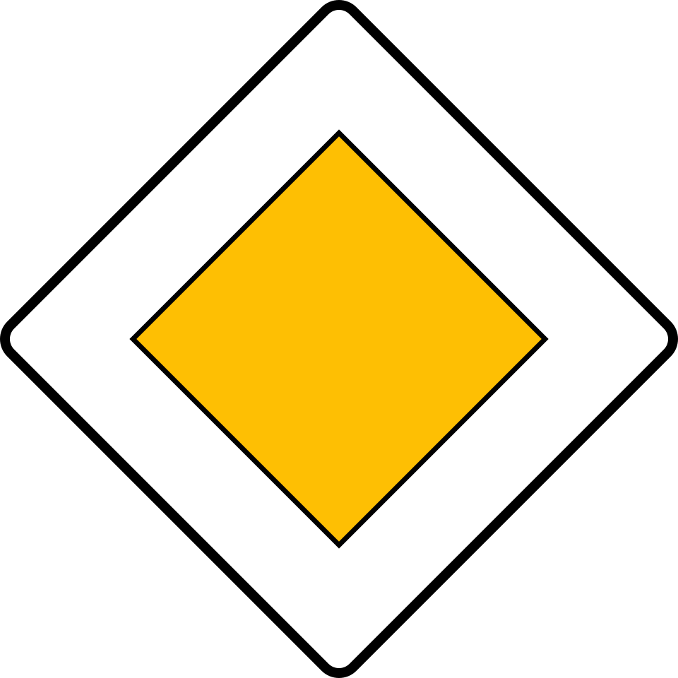{height=15%}

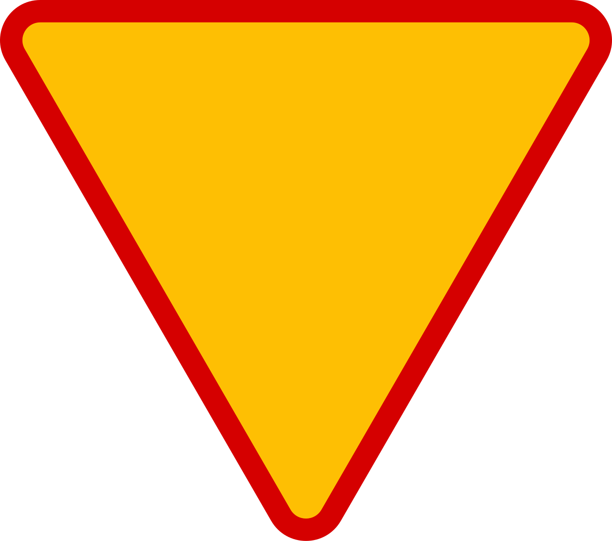{height=15%}

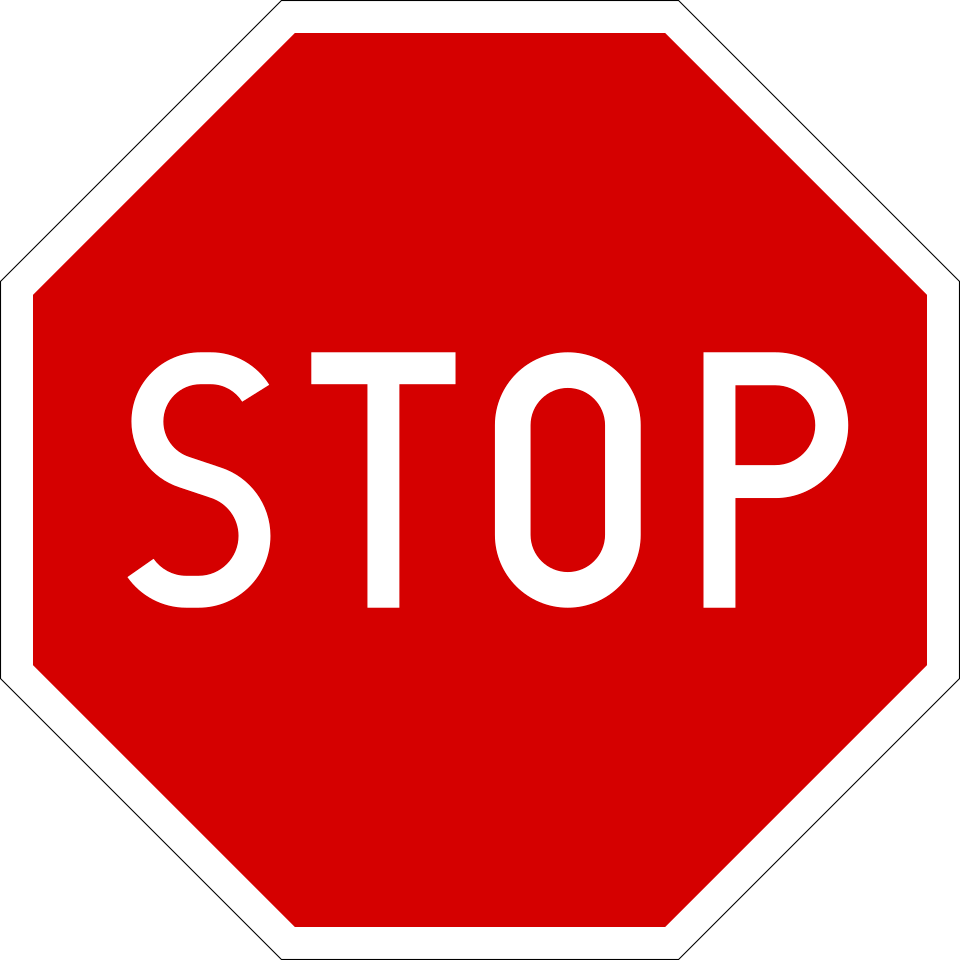{height=15%}

### Z ruchem okrężnym

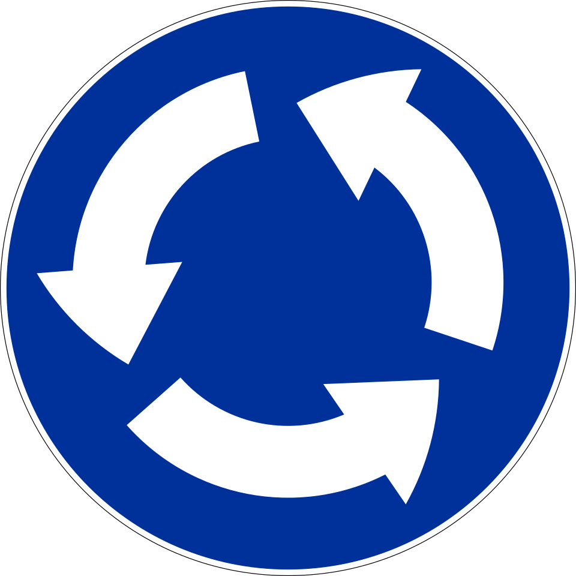{height=15%}

Standardowo wjeżdżający ma pierwszeństwo, jednak zwykle mamy znak A-7:
wjeżdżający ustępuje pierwszeństwo

## Włączenie się do ruchu 

::: {.definition title="Włączający się do ruchu" ref=""}
Pojazd który rozpoczyna jazdę po zatrzymaniu które nie było spowodowane
przepisami ruchu drogowego
:::

::: {.note title="" ref=""}
Wyjeżdżając ze strefy zamieszkania, strefy ruchu, drogi wewnętrznej lub z pasu ruchu dla pojazdów
powolnych jesteśmy włączającym się do ruchu

Pojazd szynowy wyjeżdżający z zajezdni lub z pętli też jest włączającym się do
ruchu
:::

## Obszar zabudowany

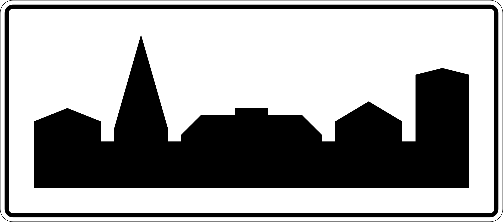{height=15%}

Podstawowe obowiązki w obszarze zabudowanym:

- Prędkość do 50 km/h 
- Zmieniamy światła drogowe na światła mijania
- Przepuszczamy transport publiczny wyjeżdżający z przystanku

---

2026-02-17

<!--# Wykład-->

## Światła 

::: {.definition title="Pozycyjne" ref=""}
Widoczne w nocy przy dobrej przejrzystości powietrza z 300m
:::

::: {.definition title="Mijania" ref=""}
Oświetlają drogę na min 40m i są asymetryczne
:::

::: {.definition title="Drogowe" ref=""}
Oświetlają drogę na min 100m
:::

::: {.definition title="Przeciwmgłowe tylne" ref=""}
Włączamy gdy widoczność $\le 50$m
:::

::: {.definition title="Awaryjne i kierunkowskazy" ref=""}
Częstotliwość mrugania $90$ cykli na minutę, $\pm 30$

::: {.note title="Pytanie testowe" ref=""}
Przyczyna zwiększonej częstotliwości mrugania świateł awaryjnych

Odpowiedź: przepalona żarówka
:::
:::

## Płyny
### Olej
Przebieg sprawdzenia poziomu oleju

- Na równej nawierzchni
- Przy chłodnym silniku
- Wyciągnąć, przetrzeć, włożyć z powrotem
- Wyciągnąć jeszcze raz i sprawdzić: poziom powinien się znajdować między
  minimum a maksimum

### Płyn chłodzący i hamulcowy
Wskazać min i max, stwierdzić że jest między min a max

::: {.note title="Dostosowanie lusterek" ref=""}
Widzieć w dolnym kącie klamkę tylnych drzwi (w lewym lustrze w prawym kącie i
na odwrót)
:::

## Parkowanie
Kryteria:

- Równolegle do innych samochodów 
- Zajmuje jedno stanowisko
- Można swobodnie otworzyć drwi i wyjść

Rodzaje:

- Skośne (wjazd przodem, wyjazd tyłem)
- Prostopadłe (przodem lub tyłem) --- **najczęściej się trafia**
- Równoległe (wjazd tyłem, wyjazd przodem)

::: {.note title="Zmiana biegów" ref=""}
Zmieniamy biegi jeśli częstotliwość obrotów silnika jest około 2000 ob/min
:::

## Droga
::: {.definition title="Jezdnia" ref=""}
Część drogi przeznaczona do ruchu pojazdów
:::
::: {.definition title="Pas ruchu" ref=""}
Część jezdni przeznaczona do ruchu pojazdów wyznaczona **lub niewyznaczona**
przez znaki drogowe
:::
::: {.definition title="Strefa ruchu" ref=""}
Droga wewnętrzna na której obowiązują przepisy jak na drogach publicznych

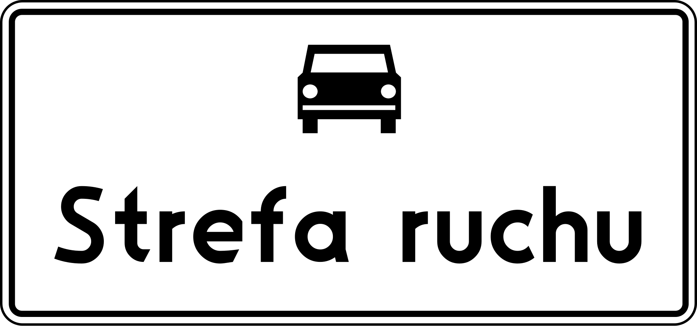{height=15%}

:::

::: {.note title="Pobocze" ref=""}
Jeśli pobocze jest oddzielone linią przerywaną, możemy zatrzymać się na poboczu,
jeśli nie, to nie
:::

### Autostrada

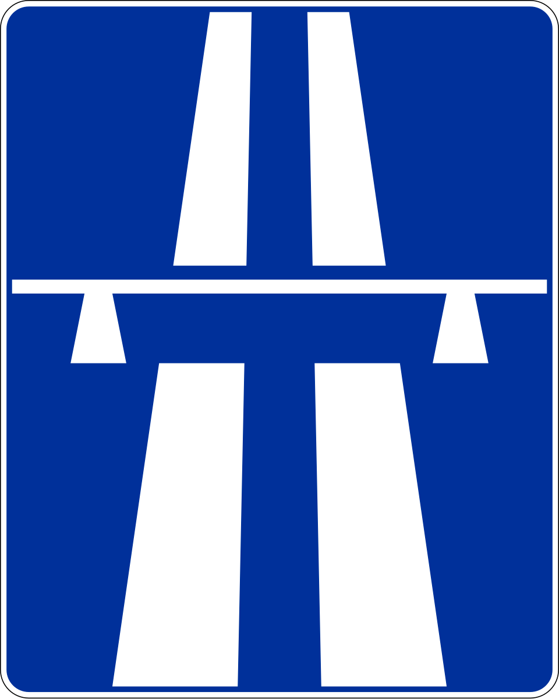{height=15%}

Może wjechać tylko pojazd samochodowy (bez czterokołowca), który może rozwijać
prędkość od 40 km/h

Prędkość maksymalna: 140 km/h

::: {.caution title="" ref=""}
**Nie ma** minimalnej prędkości

Nie wolno holować
:::

### Droga ekspresowa

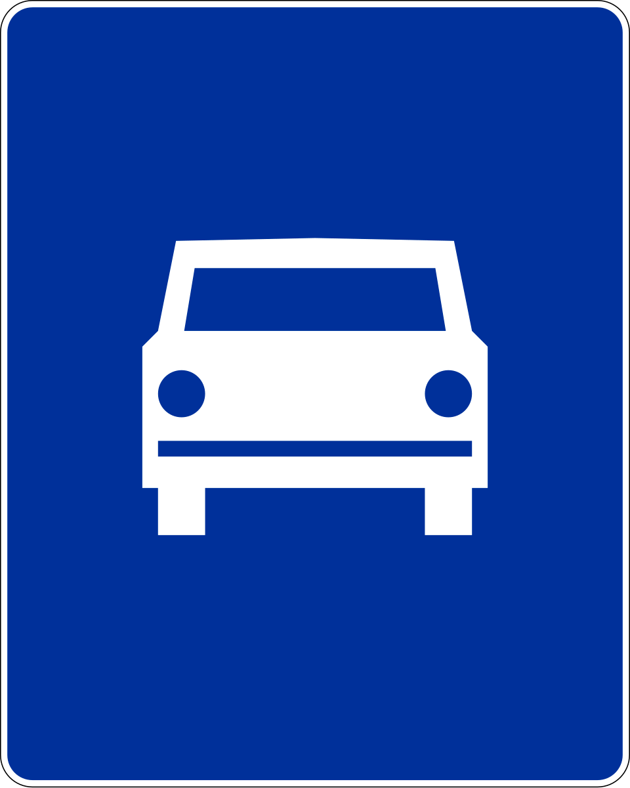{height=15%}

Może wjechać tylko pojazd samochodowy (bez czterokołowca)

Mogą występować skrzyżowania i miejsca do zawrócenia

Prędkości maksymalne:

- 1 jezdniowa --- 100 km/h 
- 2 jezdniowa --- 120 km/h

### Tunel

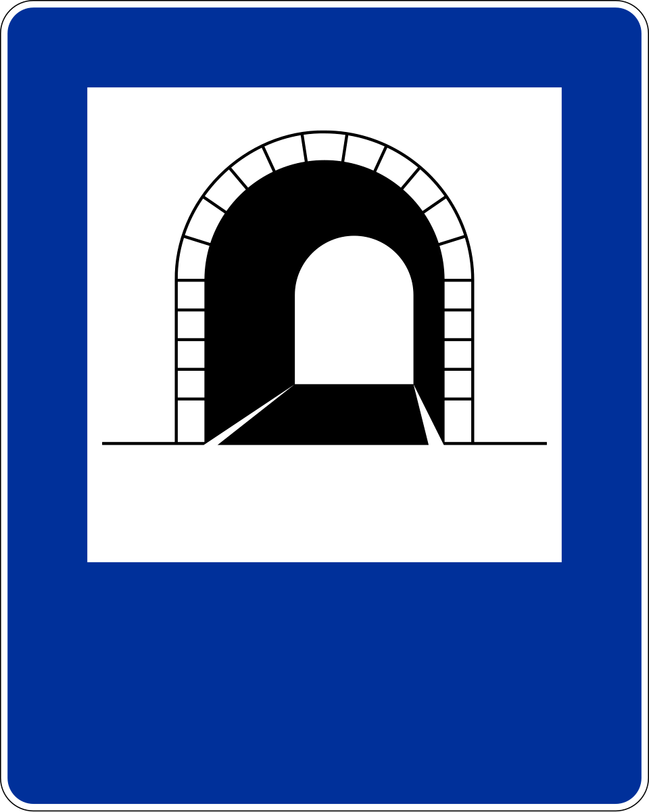{height=15%}

Jeśli jest poza obszarem zabudowanym oraz długość tunelu jest przynajmniej 500m,
to musimy zachować odległość 50m. Jeśli jest zatrzymanie (wypadek etc) ---
minimum 5m

---

2026-02-18

<!--# Wykład-->

## Znaki ostrzegawcze
Znaki ostrzegawcze są instalowane na odległości od obiektu:

- Prędkość maksymalna do 60 km/h: do 100 m (A-7: do 25m)
- Prędkość maksymalna od 60 km/h: 150 -- 300m (A-7: do 50m)

::: {.caution title="Niebezpieczne zakręty" ref=""}
Znaki Dwa niebezpieczne zakręty **kierunku drugiego zakrętu nie określają**:

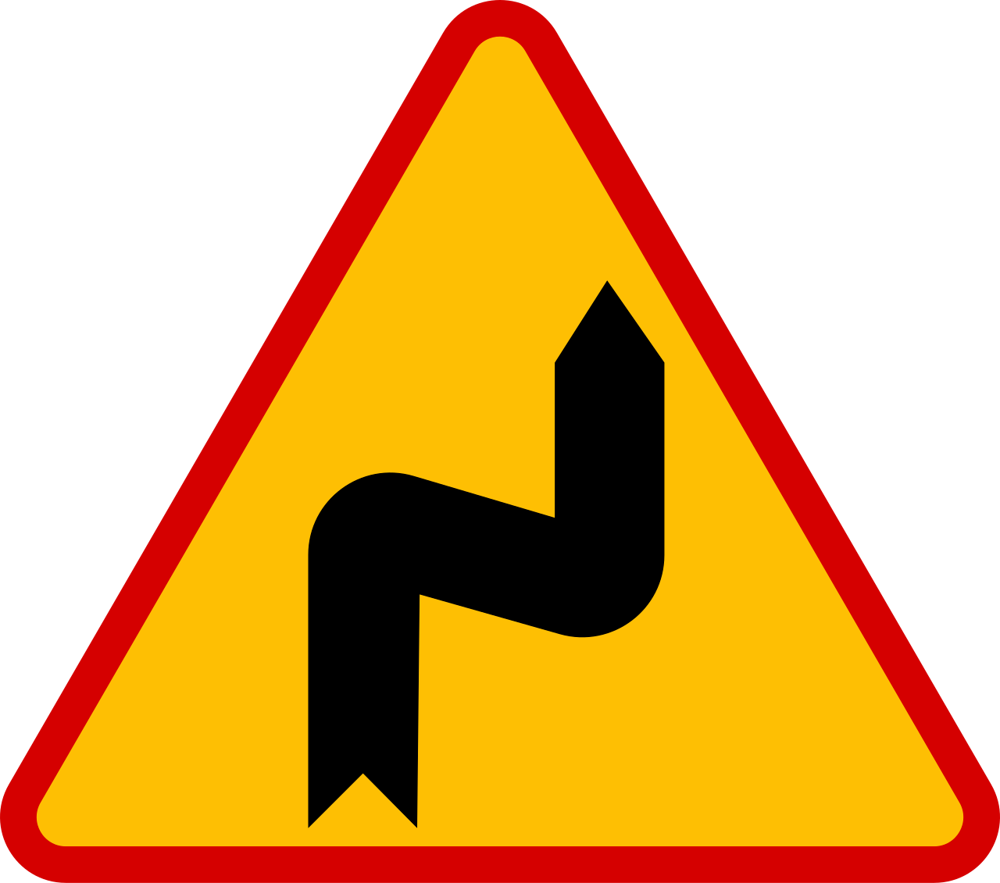{height=15%}

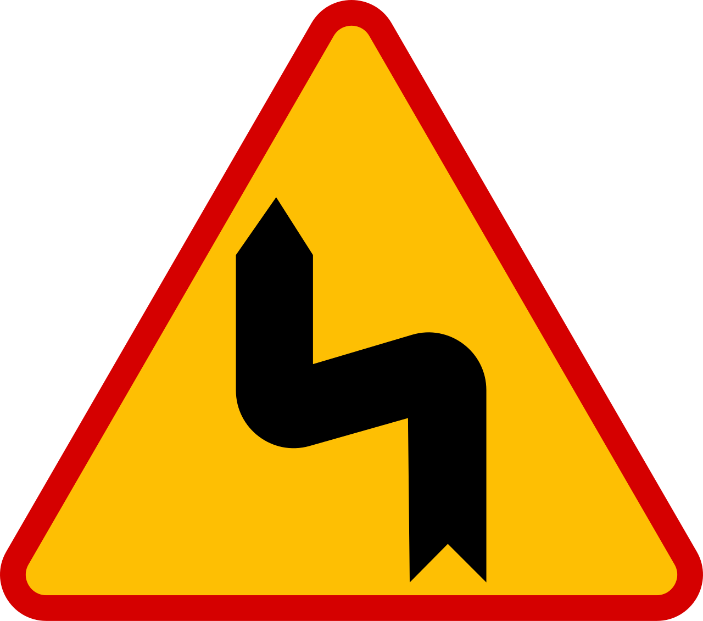{height=15%}

:::

## Wyprzedzanie
Nie wolno wyprzedzać:

- po znaku zakaz wyprzedzania
- na przejściach dla pieszych i przejazdach dla rowerzystów (oprócz tych gdzie
ruch jest kierowany)
- na niebezpiecznych zakrętach (oprócz drogi jednokierunkowej lub jeśli nie
wjeżdżamy na przeciwny pas ruchu: po 2 pasy ruchu)
- przy dojeżdżaniu do wierzchołka wzniesienia (takie same wyjątki jak powyżej)
- na przejazdach kolejowych
- na skrzyżowaniach (oprócz jeśli ruch jest kierowany lub jest o ruchu okrężnym)
- jeśli najeżdżamy na linię ciągłą pojedynczą lub podwójną

Możemy wyprzedzić z prawej strony jeśli:

- pojazd przed nami zjechał do pasa po lewej by skręcić w lewo
- w obszarze zabudowanym: mamy $\ge 2$ **wyznaczone** pasy 
- poza: mamy $\ge 3$ **wyznaczone** pasy (nie dotyczy jednokierunkowej, na niej
od 2)

::: {.caution title="" ref=""}
Na autostradach możemy wyprzedzić z prawej strony, bo jest to jezdnia
jednokierunkowa z $\ge 2$ pasami ruchu
:::

## Trójkąt awaryjny

Ustawiamy na odległości od pojazdu:

- Na obszarze zabudowanym --- tuż za pojazdem lub na pojeździe na wysokości do
1 metra
- Poza obszarem zabudowanym --- 30 metrów
- Na drodze szybkiego ruchu --- 100 metrów

## Przystanki

Nie można się zatrzymywać w obrębie:

- znaku poziomego ("zygzaków")
- zatoki
- 15m od znaku jeśli nie ma linii i zatoki

## Przejazdy kolejowe

Oznaczane są tak zwanymi Krzyżami świętego Andrzeja:

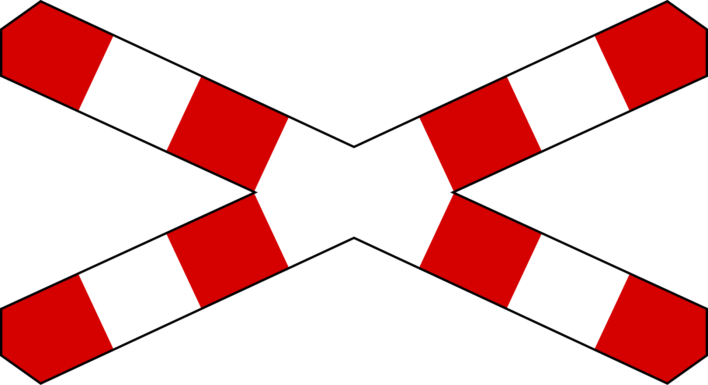{height=15%}

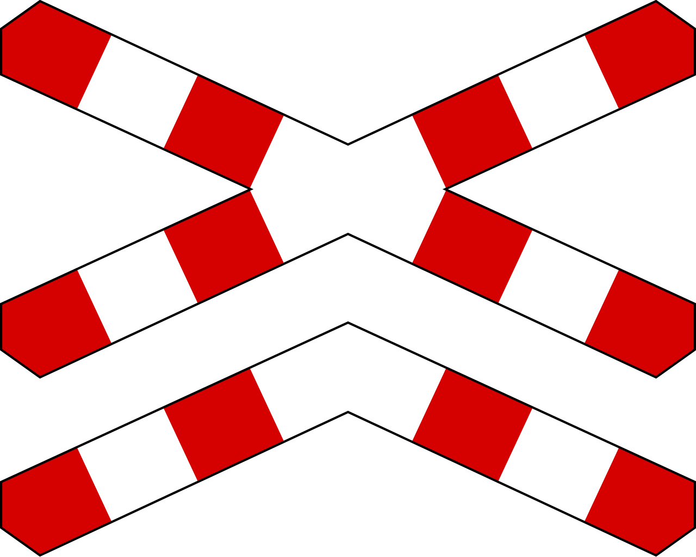{height=15%}

Krzyż świętego Andrzeja instalowany jest w 5-8 metrach od pierwszej szyny. Jak
nie widzimy linii zatrzymania, zatrzymujemy się przed krzyżem

::: {.note title="" ref=""}
Wjeżdżamy na przejazd na małym biegu, nie zmieniamy biegów na przejeździe
:::

### Znaki poprzedzające

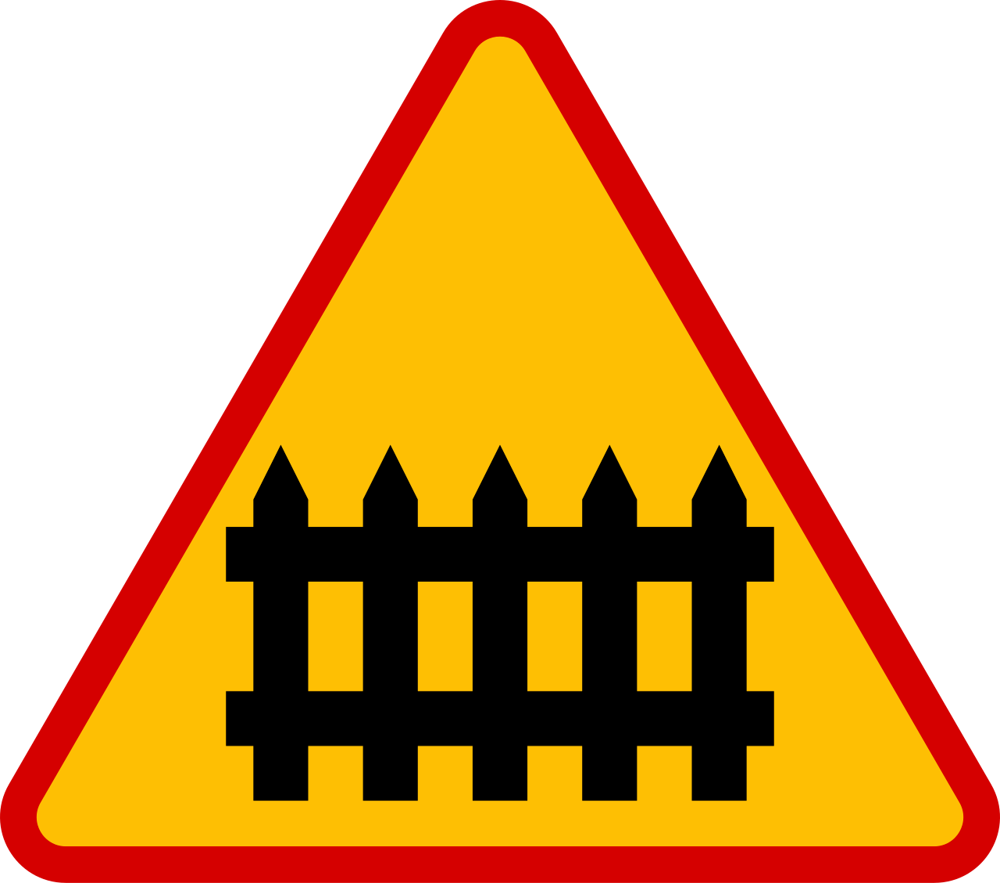{height=15%}

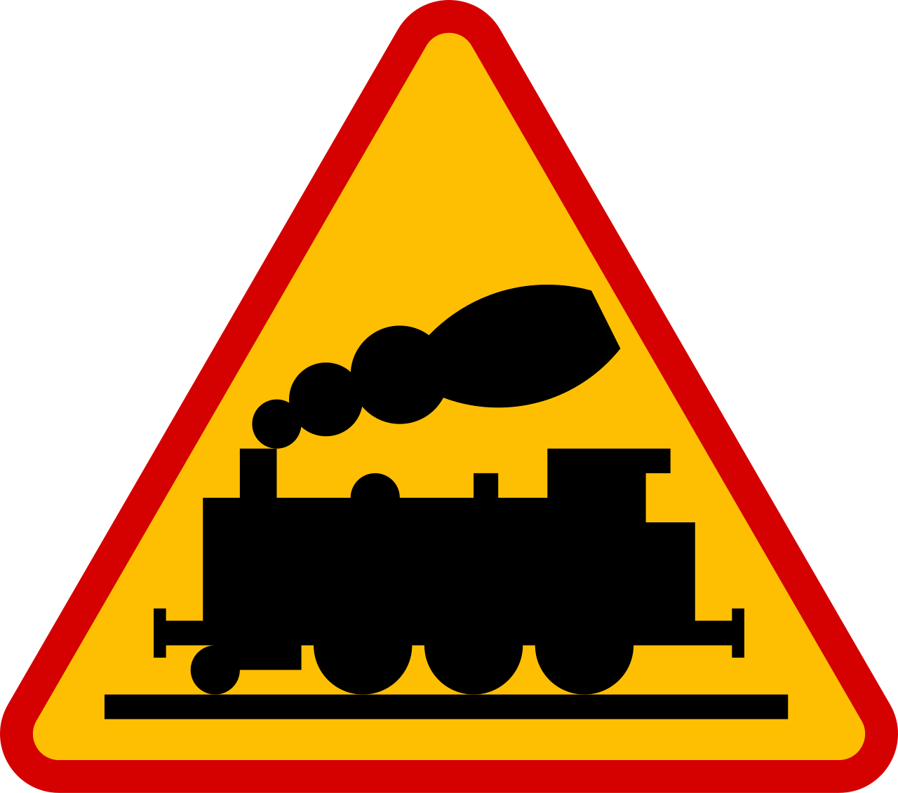{height=15%}

Dodatkowo są umieszczane G-1* według następujących reguł:

- Znak A-9 lub A-10 wraz ze znakiem z trzema paskami jest odległy tak samo jak
inne znaki ostrzegawcze (patrz [Znaki Ostrzegawcze](#znaki-ostrzegawcze))
- Z dwoma paskami jest odległy o $\frac{2}{3}$ odległości znaku z trzema paskami
od przejazdu 
- Z jednym paskiem --- $\frac{1}{3}$ odległości (bliżej niego nie )

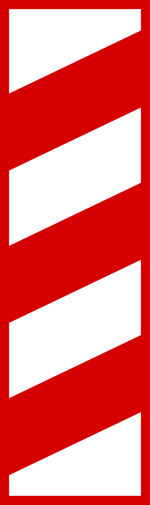{height=15%}

::: {.caution title="Zatrzymanie obok przejazdu" ref=""}
- Nie wolno się zatrzymać w odległości 10 m od przejazdu
- Nie wolno postojować na odległości bliżej znaku z jednym paskiem
:::

## Zatrzymania i postoje

::: {.definition title="Zatrzymanie" ref=""}
Unieruchomienie pojazdu do 1 min nie wynikające z warunków lub przepisów **lub**
o dowolnej długości wynikające z przepisów lub warunków

::: {.caution title="" ref=""}
Na mostach nie wolno się zatrzymać lub cofnąć
:::
:::
::: {.definition title="Postój" ref=""}
Unieruchomienie pojazdu które nie jest zatrzymaniem
:::

---

2026-02-20

::: {.note title="Wzniesienie" ref=""}
Zjeżdżamy ze stromego wzniesienia na tym samym biegu co na nie wjeżdżaliśmy
:::

## Holowanie

- Po lewej stronie z tyłu pojazdu holowanego ma być umieszczony trójkąt
ostrzegawczy
- Prędkość:
    * na obszarze zabudowanym --- 30 km/h
    * poza --- 60 km/h
- Długość linki: 4-6 m

::: {.caution title="" ref=""}
**Nie**  włączamy kierunkowskazu jeśli po zatrzymaniu kontynuujemy jazdę w
tym samym kierunku
:::

::: {.caution title="Autobusy szkolne (gimbusy)" ref=""}
Włączając się do ruchu mają pierwszeństwo w każdym
przypadku.

Jeśli dodatkowo z przodu i tyłu ma znak STOP, musimy zatrzymać się i czekać
usunięcia znaku.
:::

::: {.note title="" ref=""}
Jeśli na całej jezdni możliwy jest tylko jeden kierunek ruchu, możemy skręcać
tam z dowolnego pasa
:::

::: {.note title="" ref=""}
Na rondzie musimy włączyć kierunkowskaz na wysokości linii środkowej drogi
poprzedzającej drogą na którą zjeżdżamy
:::

::: {.caution title="" ref=""}
Tramwaj zjeżdżający z ronda **zawsze** ma pierwszeństwo
:::

## Zawracanie

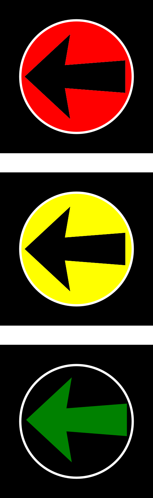{height=15%}

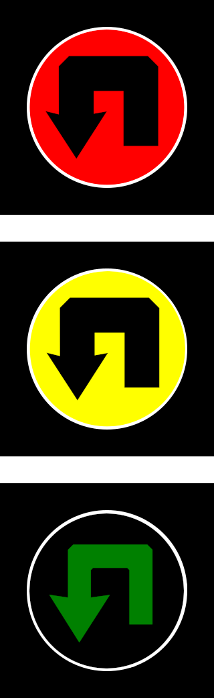{height=15%}

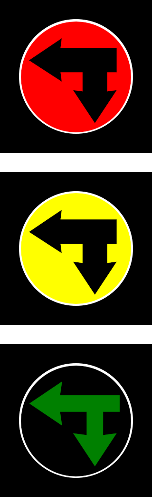{height=15%}

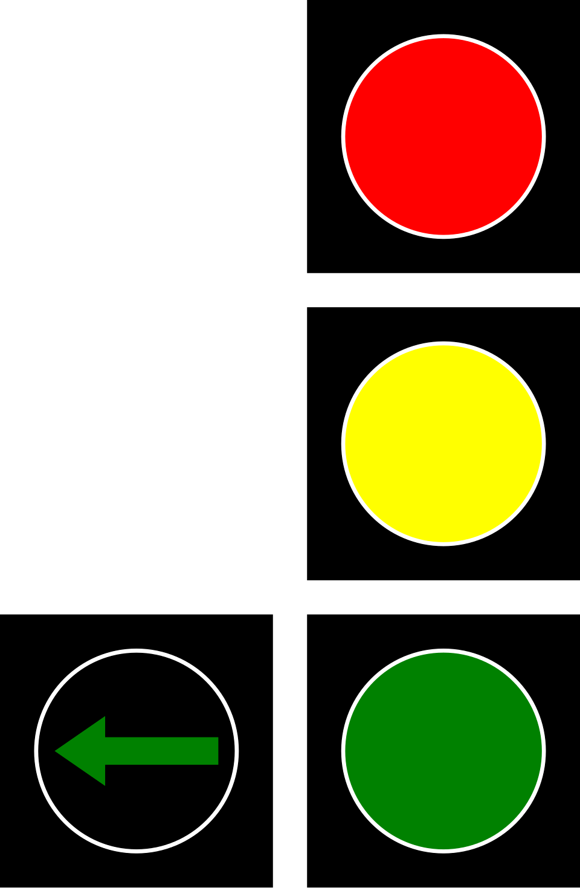{height=15%}

::: {.caution title="" ref=""}
S-2: jeśli jest czerwony i świeci się strzałka musimy się zatrzymać przed linią bezwarunkowego zatrzymania
:::

Nie możemy zawrócić przy znaku:

- Zakaz skrętu w lewo **tylko na najbliższym skrzyżowaniu** 
- Zakaz zawracania **na całym odcinku do skrzyżowania i na skrzyżowaniu** 
- Nakaz jazdy w lewo

## Koniec zakazów

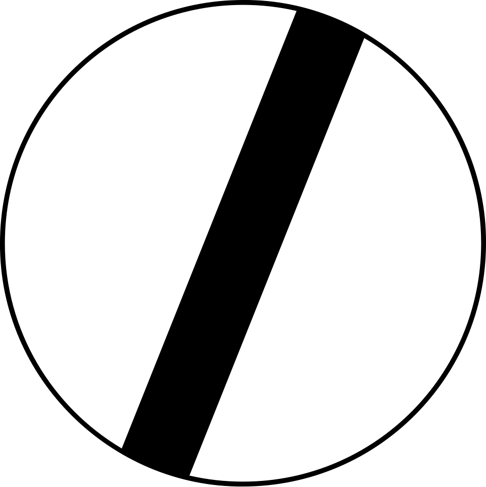{height=15%}

Znak "Koniec zakazów" odwołuje znaki zakazu:

- zawracania
- wyprzedzania (oba)
- używania sygnału dźwiękowego
- ograniczenie prędkości
