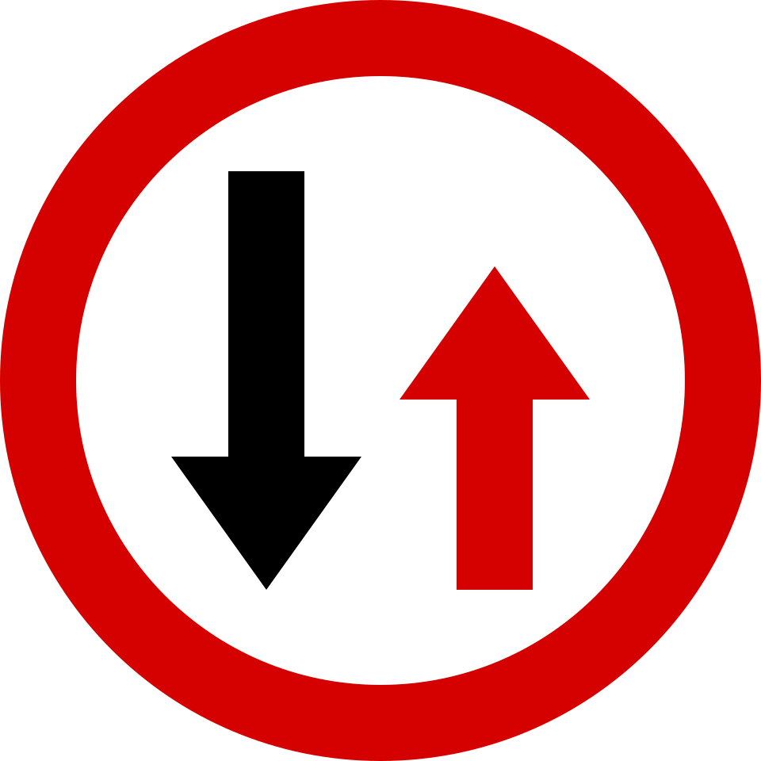
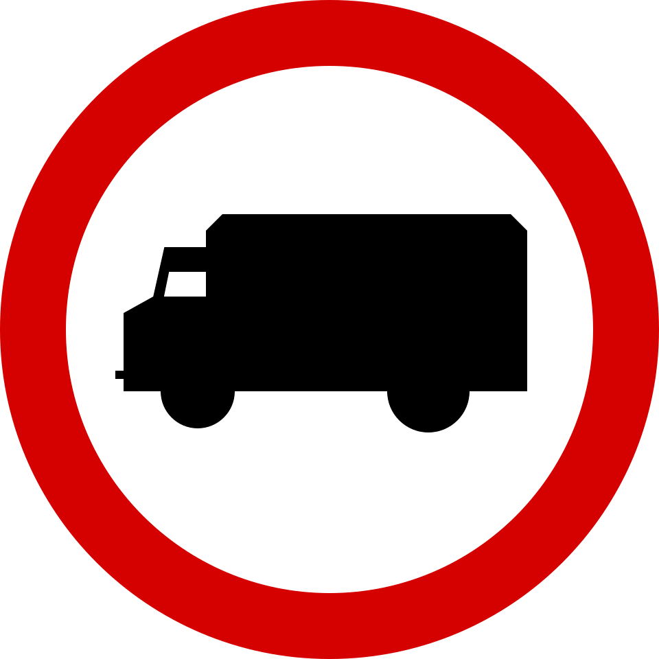
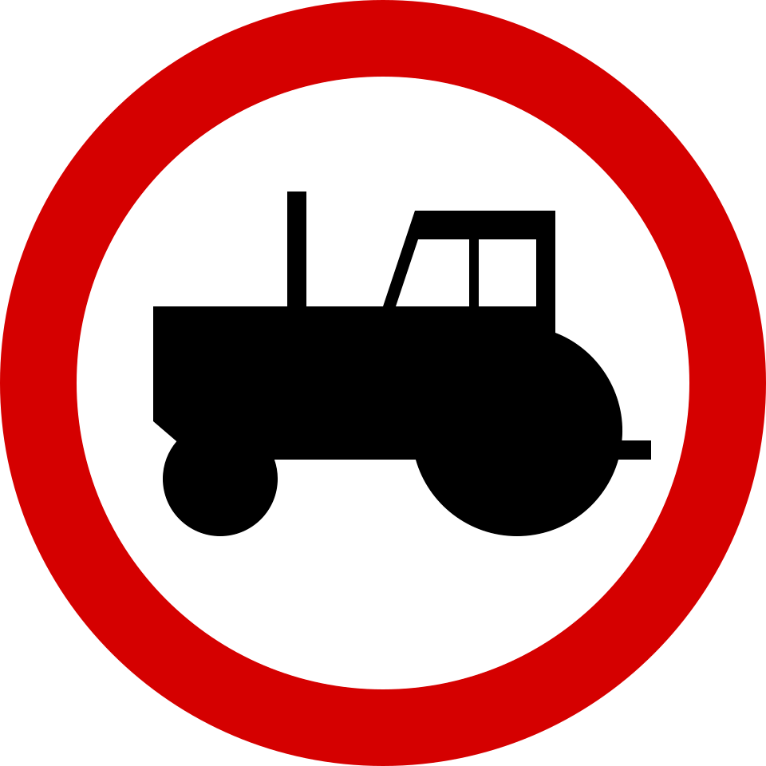
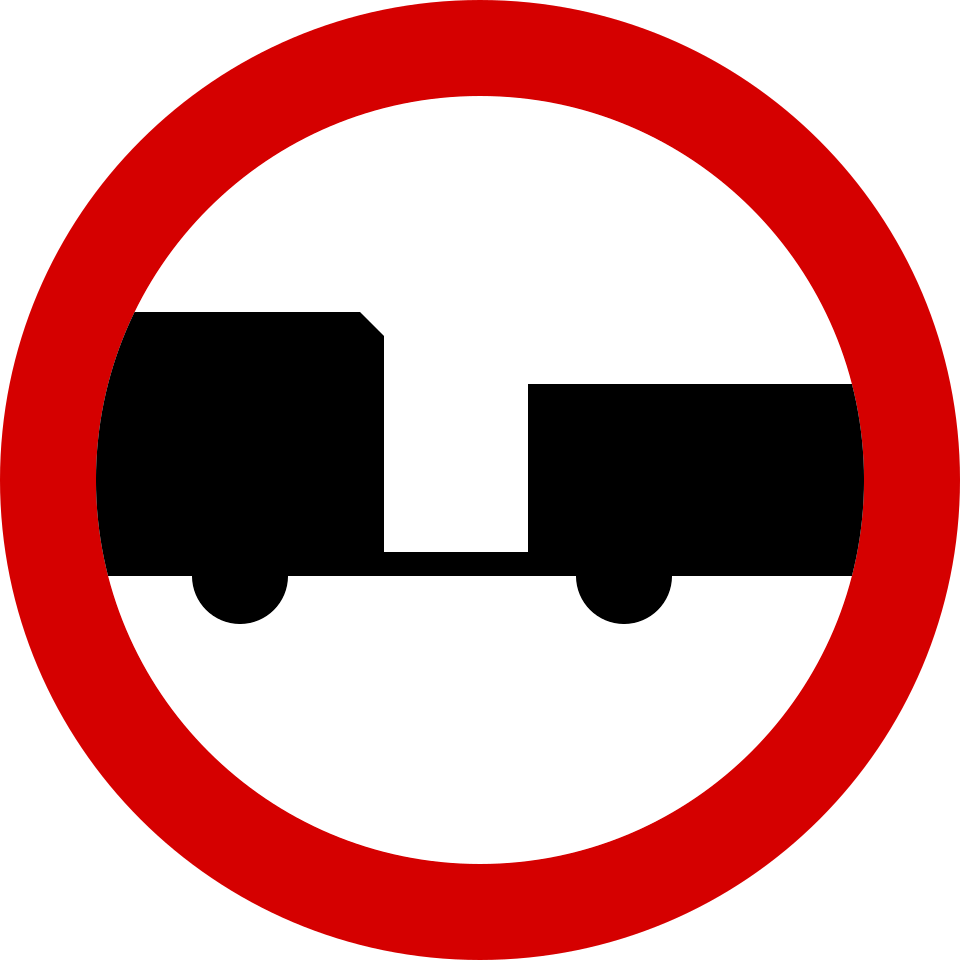

2026-02-16

8 spotkań 17:30 - 19:45 + 1 z lekarzem

- 16.02
- 17.02
- 18.02
- 20.02
- 23.02
- 24.02 --- lekarz
- 25.02
- 26.02
- 27.02

80% obecności na wykładach (7 spotkań)

## Egzamin z teorii
- Jest taki sam jak w WORD
- 32 pytania: 20 przepisy + 12 wiedza specjalistyczna --- 25 min czasu
(zaliczenie $\ge \frac{68}{74}$ pkt)

## Egzamin praktyczny
- Trwa około 45 min
- Musimy wiedzieć na czym polega
- Maksymalnie 5 minut na obsługę (sprawdzenie) samochodu
- Polecenia od egzaminatora będą zgodne z przepisami ruchu drogowego

---

# Wstęp

::: {.definition title="Pojazd silnikowy" ref=""}
Napędzany mechanicznie pojazd, który porusza się dzięki własnemu napędowi a nie
jest motorowerem ani pojazdem szynowym
:::

::: {.definition title="Pojazd samochodowy" ref=""}
Pojazd silnikowy, którego konstrukcja umożliwia jazdę z prędkością
przekraczającą 25 km/h. Określenie to nie obejmuje ciągnika rolniczego
:::

## Kategoria B

::: {.definition title="DMC" ref=""}
Dopuszczalna masa całkowita (masa własna + maksymalny ładunek)
:::
::: {.definition title="RMC" ref=""}
Rzeczywista masa całkowita (masa własna + rzeczywisty ładunek)
:::

Uprawnia do kierowania pojazdem samochodowym o DMC do 3.5 t

Opcjonalnie plus:

- Przyczepa o DMC do 750 kg **lub**
- Przyczepa dowolna ale łączna DMC zespołu $\le 3.5$ t

RMC przyczepy nie może być większa od RMC pojazdu

# Podstawowe zasady

## Skrzyżowania

Są 3 podstawowe typy skrzyżowań:

- Równorzędne
- Z pierwszeństwem
- O ruchu okrężnym (ronda)

::: {.definition title="Wymuszenie pierwszeństwa" ref=""}
Zmuszenie innego uczestnika ruchu do istotnej zmiany kierunku lub prędkości
poruszania się
:::

Jeśli znaki drogowe nie określają inaczej, możemy jechać:

- Prosto --- z dowolnego pasa ruchu
- W lewo --- tylko z lewego pasa ruchu
- W prawo --- tylko z prawego pasa ruchu

::: {.note title="" ref=""}
Jeśli na całej jezdni możliwy jest tylko skręt w jednym kierunku na
skrzyżowaniu, możemy skręcać tam z dowolnego pasa
:::

::: {.note title="Pieszy na skrzyżowaniu" ref=""}
Skręcając na drogę poprzeczną na skrzyżowaniu pieszy ma pierwszeństwo. Jeśli
przejeżdżamy na wprost na skrzyżowaniu --- my mamy pierwszeństwo przed pieszym
:::

::: {.caution title="Pierwszeństwo tramwaju" ref=""}
Jeśli jest sygnalizacja lub znaki pierwszeństwa --- traktujemy pojazd szynowy
jako zwykły samochód. 

Jeśli nie ma i jest sytuacja równorzędna samochód--tramway: tramwaj ma
pierwszeństwo.
:::

::: {.caution title="" ref=""}
Na skrzyżowaniu o ruchu okrężnym **z ruchem kierowanym** przy zjeżdżaniu **nie**
włączamy prawego kierunkowskazu. Jednak przy wjeździe i chęci skręcenia w lewo
**musimy** włączyć lewy
:::

### Równorzędne

{height=15%}

Kolejność przejazdu:

1. Pojazdy uprzywilejowane:

::: {.definition title="Pojazd uprzywilejowany" ref=""}
Mający **łącznie**:

- Sygnał świetlny niebieski
- Sygnał dźwiękowy
- Światła mijania (krótkie) lub drogowe (długie)

Zaliczamy również kolumnę (na początku i na końcu uprzywilejowane mające
dodatkowo sygnał świetlny czerwony)
:::

::: {.note title="" ref=""}
- Możemy wyprzedzić poza obszarem zabudowanym (nie zbliżając się bliżej niż na 100
metrów)
- Kolumny nie możemy wyprzedzić, zachowujemy 100m dystansu
:::

Umożliwiając mu ruch, zjeżdżamy do krawędzi **pasa** ruchu

2. Pojazd szynowy (tramwaj)
3. Pojazd z prawej strony

::: {.definition title="" ref=""}
- Omijanie --- objeżdżanie przeszkody
- Mijanie --- rozjazd z samochodem poruszającym się z przeciwnym kierunku
- Wyprzedzanie --- rozjazd z samochodem poruszającym się z tym samym kierunku

::: {.note title="Wyprzedzanie" ref=""}
Wyprzedzając pojazd jednośladowy lub kolumnę pieszych musimy zachować odstęp 1 metr
:::
:::

### Z drogą posiadającą pierwszeństwo przejazdu

Działamy zgodnie ze znakami D-1, A-7, B-20

{height=15%}

{height=15%}

{height=15%}

::: {.note title="Sygnalizacja wielofazowa" ref=""}
Skręcając w lewo jeśli mamy na wysepce lub za wysepką sygnalizator, musimy się
dostosować do jego wskazania
:::

### O ruchu okrężnym

{height=15%}

Standardowo wjeżdżający ma pierwszeństwo, jednak zwykle mamy znak A-7:
wjeżdżający ustępuje pierwszeństwo.

::: {.note title="" ref=""}
Na rondzie musimy włączyć kierunkowskaz na wysokości osi środkowej drogi
poprzedzającej drogę na którą zjeżdżamy
:::

Jeśli ruch jest **kierowany** i chcemy skręcić w lewo, musimy włączyć **lewy
kierunkowskaz** przy dojeżdżaniu do skrzyżowania. Nie ma takiego obowiązku jeśli
ruch nie jest kierowany.

### Pojazdy szynowe

Pojazdy szynowe:

- muszą się stosować do znaków pierwszeństwa jeśli one są
- jeśli jest sytuacja równorzędna, mają ma pierwszeństwo
- jeśli dwa tramwaje są równorzędne, stosuje się regułę prawej ręki

## Włączenie się do ruchu

::: {.definition title="Włączający się do ruchu" ref=""}
Pojazd który rozpoczyna jazdę po zatrzymaniu które nie było spowodowane
przepisami ruchu drogowego
:::

Szczególne przypadki włączania się do ruchu:

- Wyjeżdżając ze strefy zamieszkania, strefy ruchu, drogi wewnętrznej
- Zjeżdżając z pasu ruchu dla pojazdów powolnych jesteśmy włączającym się do
ruchu
- Pojazd szynowy wyjeżdżający z zajezdni lub z pętli

::: {.note title="" ref=""}
**Nie** włączamy kierunkowskazu jeśli po zatrzymaniu kontynuujemy jazdę w
tym samym kierunku
:::

::: {.caution title="Autobusy szkolne (gimbusy)" ref=""}
Włączając się do ruchu mają pierwszeństwo **w każdym przypadku**.

Jeśli dodatkowo z przodu i tyłu ma znak STOP, musimy **zatrzymać się i czekać
usunięcia znaku** .
:::

## Obszar zabudowany

{height=15%}

Podstawowe obowiązki w obszarze zabudowanym:

- Prędkość do 50 km/h
- Zmieniamy światła drogowe na światła mijania
- Przepuszczamy transport publiczny wyjeżdżający z przystanku

---

2026-02-17

# Obsługa samochodu

## Światła

::: {.definition title="Pozycyjne" ref=""}
Widoczne w nocy przy dobrej przejrzystości powietrza z 300m
:::

::: {.definition title="Mijania" ref=""}
Oświetlają drogę na min 40m i są asymetryczne

::: {.note title="" ref=""}
Jeśli postój trwa więcej niż 1 min i jest spowodowany przepisami ruchu drogowego
--- można wyłączyć światła zewnętrzne, a jeśli jest ciemno --- zostawić tylko
pozycyjne
:::
:::

::: {.definition title="Drogowe" ref=""}
Oświetlają drogę na min 100m
:::

::: {.definition title="Przeciwmgłowe tylne" ref=""}
Włączamy gdy widoczność $\le 50$m

::: {.note title="" ref=""}
Na drodze krętej można używać światła przeciwmgłowe od zmierzchu do świtu
również przy normalnej przejrzystości powietrza
:::
:::

::: {.definition title="Awaryjne i kierunkowskazy" ref=""}
Częstotliwość mrugania $90$ cykli na minutę, $\pm 30$

::: {.note title="Pytanie testowe" ref=""}
Przyczyna zwiększonej częstotliwości mrugania świateł awaryjnych

Odpowiedź: przepalona żarówka
:::
:::

::: {.definition title="Oświetlające tylną tablicę rejestracyjną" ref=""}
Oświetlona tablica rejestracyjna ma być widoczna z odległości 20 m
:::

## Płyny
### Olej
Przebieg sprawdzenia poziomu oleju

- Na równej nawierzchni
- Przy chłodnym silniku
- Wyciągnąć, przetrzeć, włożyć z powrotem
- Wyciągnąć jeszcze raz i sprawdzić: poziom powinien się znajdować między
  minimum a maksimum

### Płyn chłodzący i hamulcowy
Wskazać min i max, stwierdzić że jest między min a max

::: {.note title="Dostosowanie lusterek" ref=""}
Widzieć w dolnym kącie klamkę tylnych drzwi (w lewym lustrze w prawym kącie i
na odwrót)
:::

# Część główna

## Parkowanie
Kryteria:

- Równolegle do innych samochodów
- Zajmuje jedno stanowisko
- Można swobodnie otworzyć drwi i wyjść

Rodzaje:

- Skośne (wjazd przodem, wyjazd tyłem)
- Prostopadłe (przodem lub tyłem) --- **najczęściej się trafia**
- Równoległe (wjazd tyłem, wyjazd przodem)

::: {.note title="Zmiana biegów" ref=""}
Zmieniamy biegi jeśli częstotliwość obrotów silnika jest około 2000 ob/min
:::

## Droga
::: {.definition title="Jezdnia" ref=""}
Część drogi przeznaczona do ruchu pojazdów
:::
::: {.definition title="Pas ruchu" ref=""}
Część jezdni przeznaczona do ruchu pojazdów wyznaczona **lub niewyznaczona**
przez znaki drogowe
:::
::: {.definition title="Strefa ruchu" ref=""}
Droga wewnętrzna na której obowiązują przepisy jak na drogach publicznych

{height=15%}
:::

::: {.note title="Pobocze" ref=""}
Jeśli pobocze jest oddzielone linią przerywaną, możemy zatrzymać się na poboczu,
jeśli nie, to nie
:::

### Autostrada

{height=15%}

Może wjechać tylko pojazd samochodowy (bez czterokołowca), który może rozwijać
prędkość od 40 km/h

Prędkość maksymalna: 140 km/h

::: {.caution title="" ref=""}
**Nie ma** minimalnej prędkości

Nie wolno holować
:::

### Droga ekspresowa

{height=15%}

Może wjechać tylko pojazd samochodowy (bez czterokołowca)

Mogą występować skrzyżowania i miejsca do zawrócenia

Prędkości maksymalne:

- 1 jezdniowa --- 100 km/h
- 2 jezdniowa --- 120 km/h

### Tunel

{height=15%}

Jeśli jest poza obszarem zabudowanym oraz długość tunelu jest przynajmniej 500m,
to musimy zachować odległość 50m. Jeśli jest zatrzymanie (wypadek etc),
**niezależnie** od długości i położenia --- minimum 5m

---

2026-02-18

<!--# Wykład-->

## Znaki ostrzegawcze
Znaki ostrzegawcze są instalowane na odległości od obiektu:

- Prędkość maksymalna do 60 km/h: do 100 m (A-7: do 25m)
- Prędkość maksymalna od 60 km/h: 150 -- 300m (A-7: do 50m)

::: {.caution title="Niebezpieczne zakręty" ref=""}
Znaki Dwa niebezpieczne zakręty **kierunku drugiego zakrętu nie określają**:

{height=15%}

{height=15%}

:::

## Wyprzedzanie
Nie wolno wyprzedzać:

- po znaku zakaz wyprzedzania
- na przejściach dla pieszych i przejazdach dla rowerzystów (oprócz tych gdzie
ruch jest kierowany)
- na niebezpiecznych zakrętach (oprócz drogi jednokierunkowej lub jeśli nie
wjeżdżamy na przeciwny pas ruchu: po 2 pasy ruchu)
- przy dojeżdżaniu do wierzchołka wzniesienia (takie same wyjątki jak powyżej)
- na przejazdach kolejowych
- na skrzyżowaniach (oprócz jeśli ruch jest kierowany lub jest o ruchu okrężnym)
- jeśli najeżdżamy na linię ciągłą pojedynczą lub podwójną

Możemy wyprzedzić z prawej strony jeśli:

- pojazd przed nami zjechał do pasa po lewej by skręcić w lewo
- w obszarze zabudowanym: mamy $\ge 2$ **wyznaczone** pasy
- poza: mamy $\ge 3$ **wyznaczone** pasy (nie dotyczy jednokierunkowej, na niej
od 2)

::: {.caution title="" ref=""}
Na autostradach możemy wyprzedzić z prawej strony, bo jest to jezdnia
jednokierunkowa z $\ge 2$ pasami ruchu
:::

## Trójkąt awaryjny

Ustawiamy na odległości od pojazdu:

- Na obszarze zabudowanym --- tuż za pojazdem lub na pojeździe na wysokości do
1 metra
- Poza obszarem zabudowanym --- 30-50 metrów
- Na drodze szybkiego ruchu --- 100 metrów

## Przystanki

Nie można się zatrzymywać w obrębie:

- znaku poziomego ("zygzaków")
- zatoki
- 15m od znaku jeśli nie ma linii i zatoki

## Przejazdy kolejowe

Oznaczane są tak zwanymi Krzyżami świętego Andrzeja:

{height=15%}

{height=15%}

Krzyż świętego Andrzeja instalowany jest w 5-8 metrach od pierwszej szyny. Jak
nie widzimy linii zatrzymania, zatrzymujemy się przed krzyżem

::: {.note title="" ref=""}
Wjeżdżamy na przejazd na małym biegu, nie zmieniamy biegów na przejeździe
:::

Jeśli jest znak rogatka uszkodzona, nie możemy wjechać aż osoba kierująca ruchem
nie zezwoli na to

Jeśli pojazd stanie na przejeździe --- usuń jego z torów, jeśli to niemożliwe --
poinformuj kierującego pociągu

### Znaki poprzedzające

{height=15%}

{height=15%}

Dodatkowo są umieszczane G-1* według następujących reguł:

- Znak A-9 lub A-10 wraz ze znakiem z trzema paskami jest odległy tak samo jak
inne znaki ostrzegawcze (patrz [Znaki Ostrzegawcze](#znaki-ostrzegawcze))
- Z dwoma paskami jest odległy o $\frac{2}{3}$ odległości znaku z trzema paskami
od przejazdu
- Z jednym paskiem --- $\frac{1}{3}$ odległości (bliżej niego nie )

{height=15%}

::: {.caution title="Zatrzymanie obok przejazdu" ref=""}
- Nie wolno się zatrzymać w odległości 10 m od przejazdu
- Nie wolno postać na odległości bliżej znaku z jednym paskiem
:::

## Zatrzymania i postoje

::: {.definition title="Zatrzymanie" ref=""}
Unieruchomienie pojazdu do 1 min nie wynikające z warunków lub przepisów **lub**
o dowolnej długości wynikające z przepisów lub warunków

::: {.caution title="" ref=""}
Na mostach nie wolno się zatrzymać lub cofnąć
:::
:::
::: {.definition title="Postój" ref=""}
Unieruchomienie pojazdu które nie jest zatrzymaniem
:::

Nie wolno **zatrzymać**  pojazd:

- tak, by zmusić innych w celu omijania na przekraczanie linii ciągłej
- w odległości bliżej niż 10 m **przed**  przejściem lub przejazdu oraz **za,
jeśli** jest 1 pas ruchu w każdym kierunku
- w odległości bliżej 10 m od znaku **jeśli** pojazd by zasłonił ten znak

**Postój** jest zabroniony:

- na wyjazdach
- przed zaparkowanymi pojazdami
- na jezdni poza obszarem zabudowanym
- na chodniku (wyjątki poniżej)

### Postój na chodniku

Jeśli nie ma zakazu, możemy urządzać postój na chodniku jeśli spełnione są
**jednocześnie** warunki:

- DMC samochodu nie przekracza 2.5 t
- parkujemy równolegle do krawężnika i blisko do niego lub jeśli chodnik jest
szeroki --- prostopadle tyłem do drogi
- zostawimy 1.5 m przejścia
- nie utrudnia to ruchu pieszym

---

2026-02-20

::: {.note title="Wzniesienie" ref=""}
Zjeżdżamy ze stromego wzniesienia na tym samym biegu co na nie wjeżdżaliśmy
:::

## Zawracanie

{height=15%}

{height=15%}

{height=15%}

{height=15%}

::: {.caution title="" ref=""}
S-2: jeśli jest czerwony i świeci się strzałka musimy się zatrzymać przed linią bezwarunkowego zatrzymania
:::

Nie możemy zawrócić przy znaku:

- Zakaz skrętu w lewo **tylko na najbliższym skrzyżowaniu**
- Zakaz zawracania **na całym odcinku do skrzyżowania i na skrzyżowaniu**
- Nakaz jazdy w lewo

## Koniec zakazów

{height=15%}

Znak "Koniec zakazów" odwołuje znaki zakazu:

- zawracania
- wyprzedzania (oba)
- używania sygnału dźwiękowego
- ograniczenie prędkości

---

2026-02-23

## Prędkości

Prędkości poza obszarem zabudowanym:

- Jednojezdniowa: 90 km/h
- Dwujezdniowa: 100 km/h

Z przyczepą:

- Jednojezdniowa: 70 km/h 
- Dwujezdniowa (w tym drogi szybkiego ruchu): 80 km/h

## Znaki zakazu

Jeśli mamy 100% pewność że wymienimy się, możemy nie stosować się do znaku B-31

{height=20%}

Znak ograniczenie prędkości jest odwoływany przez najbliższe skrzyżowanie

Zakaz postoju w dni parzyste/nieparzyste nie obowiązują w godzinach 21-24

### Zakazy wjazdu

#### Ciężarówek

{height=20%}

Zakaz wjazdu samochodów ciężarowych zabrania wjazdu:

- pojazd wolnobieżny (taki, którego cechy konstrukcyjne ograniczają prędkość do
25 km/h --- przeciwieństwo samochodowego)
- wszelkie ciągniki
- specjalnych których masa jest więcej niż 3.5 t

#### Ciągników

{height=20%}

Zakaz wjazdu ciągników rolniczych też zabrania wjazdu pojazdów wolnobieżnych

#### Przyczepy
{height=20%}

B-7 nie dotyczy jednoosiowej przyczepy i naczepy

## Systemy wspomagania sterowania

### ABS

Pomaga w hamowaniu na śliskiej nawierzchni jako alternatywa hamowaniu
przerywanemu

### ESP

Pomaga w sterowaniu i trzymaniu sprzężenia z drogą na zakrętach przyhamowując do
odpowiedniej prędkości

### ASR

Pomaga ruszyć na śliskiej nawierzchni, na przykład jeśli niektóre koła są na
suchej, a niektóre na śliskiej nawierzchni

### Hill hold

Pomaga ruszać na wzniesieniu. Działa przez 2 sekundy blokując koła po
odpuszczeniu hamulca roboczego.

## Wymijanie i wyprzedzanie

### Wymijanie

Zaleca się zmienić światła drogowe na mijania przy wymijaniu, by nie oślepić
kierowcę jadącego z naprzeciwka.

::: {.caution title="" ref=""}
Zmiana światła kierowcy jadącego z naprzeciwka jest **nakazem** nam do zmiany
swoich świateł (jest takim znakiem, że nasze światła są oślepiające)
:::

### Wyprzedzanie

Musimy zmienić światła drogowe na mijania jak jesteśmy w 150 metrach (jak widzimy odblaski od jego świateł odblaskowych). Jak jesteśmy na tym samym poziomie, on musi zmienić, a my wracamy do drogowych.

Pojazdy szynowe wyprzedzamy z prawej strony, chyba że:

- położenie torowiska nie pozwala na to (na przykład jest z prawej strony
jezdni)
- jest do droga jednokierunkowa

wtedy możemy wyprzedzić z lewej.

Obowiązki gdy jesteśmy wyprzedzani:

- nie zwiększać prędkości 
- w razie potrzeby zbliżyć się do prawej krawędzi jezdni

### Cofanie
Nie wolno wykonywać cofania:

- w tunelach
- na mostach i wiaduktach
- na drogach szybkiego ruchu
- na zakrętach, wierzchołkach wzniesień
- na drogach o dużym stężeniu ruchu

---

2026-02-24

# Medycyna

## Reanimacja

Mamy obowiązek udzielić pomocy, chyba że nam coś zagraża.

Kolejność działań:

1. Ocena sytuacji
2. Liczba poszkodowanych (brać pod uwagę, że np motocykle mogą mieć pasażerów
   lub ktoś nie zapiął pasa i wyleciał z auta)
3. Stan poszkodowań ofiar (rozpoczynamy pomoc od najbardziej poszkodowanej)
4. Dzwonimy 112
5. Sprawdzić czy osoba jest przytomna:
    a. kontakt słowny (zadać pytania)
    b. kontakt fizyczny (**tylko** potrząsanie za ramię, **nie** bijemy po pysku)
6. Sprawdzanie parametrów życiowych:
    a. oddech --- pochylenie nad nosem: klatka piersiowa (jeśli nie widzimy,
        zdejmujemy odzież i kładziemy rękę) + słyszymy oddech + odczuwamy oddychane
        powietrze (10-12 sekund, 2-3 cykle oddechowe)
    b. tętno --- z boku szyi lub uda (nie jest obowiązkowe, bo wynik może być
obciążony i wystarczy warunku braku oddechu)
7. Układamy na płaskiej twardej powierzchni w bezpiecznym miejscu. **Nie**  kładziemy
   nic pod głowę, nawet odchylamy ją trochę do tyłu i otwieramy usta na 2 cm
8. Sprawdzamy czy nie ma przeszkód w drogach oddechowych, jak są -- wyjmujemy
9. Powtarzamy:
    a. 30 uciśnięć nadgarstkiem (nie dłonią) z wyprostowanym łokciem na 4-5 cm
       100-110 razy/min wisząc prostopadle
    b. 2 oddechy zaciskając nos obserwując klatkę piersiową. Jeśli nie wiemy jak
       robić lub podejrzewamy o choroby zakaźne, nie robimy
10. Robimy aż:
    a. pacjent przywróci do życia
    b. nie mamy już sił
    c. przybędzie karetka

::: {.note title="" ref=""}
Nie wolno nam samodzielnie zakończyć reanimacji bez spełnienia chociażby jednego
warunku powyżej, a tym bardziej stwierdzić śmierci rannego
:::

11. Przewracamy na bok i zabezpieczamy ciepło

::: {.note title="Test" ref=""}
Mózg umiera bez tlenu po 4.5 min
:::

## Reanimacja dziecka

1. Kładziemy na ręku głową w dół i bijemy
2. Reanimację małym dzieciom robimy dwoma palcami, większym --- jednym nadgarstkiem

## Złamanie

1. Unieruchomić dwa sąsiednie stawy
2. **Nie** nastawiamy kości z powrotem

## Kręgosłup

By sprawdzić czy jest uszkodzony:

- Poprosić o poruszanie kończynami
- Szczypnąć w kończynę i zapytać **czy** czuje i czy czuje **tak samo** na obu kończynach

Jeśli nie ma potrzeby, nie wyciągamy z auta, jednak jeśli potrzebuje reanimacji
lub zagraża mu coś, wyciągamy.

Przy wyciąganiu stabilizujemy głowę, np można poprosić kogoś o przytrzymanie

## Apteczka

Zalecany skład apteczki:

- rękawiczki lateksowe kilka par
- maseczka do sztucznego oddychania
- gaziki
- bandage elastyczne
- siatka opatrunkowa Codofix
- trójkąt
- plastry
- folia egzotermiczna
- nożyczki

Ekstra:

- kamizelka odblaskowa
- latarka
- młotek do wybijania szyb
- przecinacz do pasów bezpieczeństwa
- miś

---

2026-02-25

# Ciąg dalszy

## Przewóz ładunków

Ładunek nie może wystawać za granice pojazdu nie więcej niż na:

- z przodu --- 1.5 m
- z tyłu --- 2 m

Oznakujemy czerwoną chorągiewką jeśli wystaje o więcej niż 0.5 m. Możemy
zamiast tego zawiesić bryłę pomalowana białymi i czerwonymi pasami o łącznej
powierzchni $\ge 1000 \text{ cm}^2$  

::: {.note title="Ładunki niebezpieczne" ref=""}
Pojazdy przewożące ładunki niebezpieczne są oznaczone pomarańczowym prostokątem
:::

## Droga zatrzymania

::: {.definition title="Droga zatrzymania" ref=""}
Droga zatrzymania składa się z:

- Czas reakcji psychicznej kierującego: około 0.5 sec
- Droga przebyta podczas opóźnienia działania hamulca (od momentu naciśnięcia na
hamulec do momentu jak zacznie działać)
- Droga hamowania (nie jest więc ona tym samym co droga zatrzymania)
:::

---
2026-02-26

## Holowanie

- Po lewej stronie z tyłu pojazdu holowanego ma być umieszczony trójkąt
ostrzegawczy
- Prędkość:
    * na obszarze zabudowanym --- 30 km/h
    * poza --- 60 km/h

Musi mieć sprawne przynajmniej układów hamulcowych na połączeniu:

- giętkim --- co najmniej 2
- sztywnym --- co najmniej 1

::: {.note title="Układy hamulcowe" ref=""}
W każdym samochodzie są 3 układy hamulcowe:

- ręczny (tylko koła jednej osi, zwykle tylnej):
    * awaryjny (skuteczność jest uzależniona od wysokości dźwigni)
    * postojowy (zwykle używamy)
- zasadniczy (roboczy, działa na wszystkie osie)
:::

Odległość między pojazdami na holu:

- na holu sztywnym: nie więcej niż 3 m
- giętkim: 4-6 m
